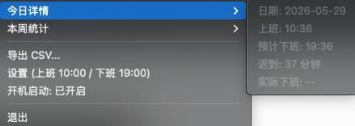

# worktime

macOS 上下班时间监测菜单栏工具。通过解析 `pmset -g log` 系统日志，自动识别上下班时间，在菜单栏实时显示状态，并在到点下班时发送通知提醒。

## 功能

- 自动识别上班时间（9:00-11:00 窗口内首次唤醒/登录/开盖事件）
- 自动识别下班时间（18:00 后最后一次屏幕关闭/合盖睡眠事件）
- 菜单栏实时显示：预计下班时间 / 剩余倒计时 / 已下班
- 到点下班通知（macOS 原生通知）
- 右键菜单设置上下班时间、开机启动开关
- CLI 查看今日/本周考勤统计
- 导出 CSV 考勤记录（支持 Excel 中文显示）
- LaunchAgent 开机自启

## 截图

- 菜单栏图标：

- 主界面：
- 今日：
- 一周：

## 安装

### Homebrew（推荐）

```bash
brew tap Soarkey/tap https://github.com/Soarkey/homebrew-tap
brew install worktime
```

或一步到位：

```bash
brew install Soarkey/tap/worktime
```

### 从源码编译

```bash
git clone https://github.com/Soarkey/worktime.git
cd worktime
make build
```

编译产物在 `build/worktime`。

## 使用

### 启动守护进程

```bash
worktime daemon
```

启动后菜单栏会显示考勤状态，每分钟自动刷新。

### 设置上下班时间

通过菜单栏点击"设置"项弹窗修改，或使用 CLI：

```bash
worktime config                          # 查看当前设置
worktime config --start-hour 9 --start-min 30 --end-hour 18 --end-min 30
```

配置保存在 `~/.worktime/config.json`，默认上班 10:00，下班 19:00。

### 开机自启

菜单栏中可直接开关，或使用 CLI：

```bash
worktime install    # 安装 LaunchAgent
worktime uninstall  # 卸载 LaunchAgent
```

### CLI 命令

```bash
worktime status    # 查看当前状态
worktime today     # 今日考勤详情
worktime week      # 本周统计
worktime export    # 导出 CSV（默认 worktime.csv）
worktime export -o ~/Desktop/attendance.csv
```

### 卸载

```bash
worktime uninstall          # 仅卸载 LaunchAgent
worktime uninstall --purge  # 同时清理日志
```

## 配置

| 参数 | 默认值 | 说明 |
|------|--------|------|
| 标准上班时间 | 10:00 | 可通过菜单栏或 CLI 修改 |
| 标准下班时间 | 19:00 | 可通过菜单栏或 CLI 修改 |
| 上班检测窗口 | 9:00-11:00 | 此窗口内首个事件视为上班 |
| 下班检测起始 | 18:00 | 此时间后的事件视为下班 |
| 轮询间隔 | 1 分钟 | pmset 日志刷新频率 |

## 数据存储

- 配置：`~/.worktime/config.json`
- 日志：`~/Library/Logs/worktime/`

## 技术栈

- Go 1.22+
- [energye/systray](https://github.com/energye/systray) — 菜单栏
- [spf13/cobra](https://github.com/spf13/cobra) — CLI 框架
- macOS `osascript` — 原生通知与弹窗

## License

MIT
