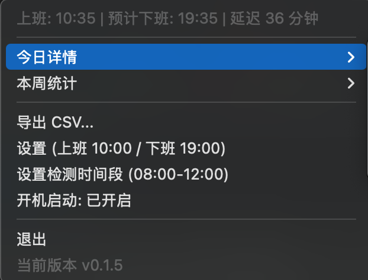
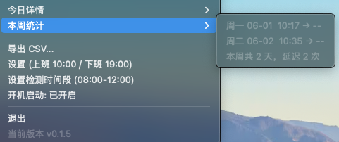

# worktime

macOS 上下班时间监测菜单栏工具。通过解析 `pmset -g log` 系统日志，自动识别上下班时间，在菜单栏实时显示状态。

## 功能

- 自动识别上班时间（可配置时间段内首次唤醒/登录/开盖事件，默认 8:00-12:00）
- 自动识别下班时间（18:00 后最后一次屏幕关闭/合盖睡眠事件）
- 菜单栏实时显示：预计下班时间 / 剩余倒计时（<= 30 分钟显示） / 已下班
- 菜单栏右键设置上下班时间、上班统计时间段、导出 CSV
- CLI 查看今日/本周考勤统计
- 导出 CSV 考勤记录（含 UTF-8 BOM，Excel 中文兼容）

## 截图

- 菜单栏图标：
- 主界面：
- 今日：
- 一周：

## 安装

### Homebrew（推荐）

```bash
brew install Soarkey/tap/worktime
```

安装后：

```bash
worktime start   # 启动菜单栏应用（launchctl 守护进程）
worktime stop    # 停止后台服务
```

### 从源码编译

```bash
git clone https://github.com/Soarkey/worktime.git
cd worktime
make build
```

编译产物在 `build/worktime`。编译后同样可使用 `worktime start` / `worktime stop` 管理后台服务。

## 使用

默认上班 10:00，下班 19:00，上班统计时间段 8:00-12:00。

### CLI 命令

```bash
worktime --help         # 查看所有命令说明

worktime today          # 今日考勤详情
worktime week           # 本周统计
worktime config         # 查看或设置上下班时间与统计时间段
worktime export         # 导出 CSV（默认 worktime.csv）
worktime export -o ~/Desktop/attendance.csv
```

### 菜单栏状态

菜单栏图标显示三种状态：

| 状态 | 条件 | 显示 |
|------|------|------|
| 工作中 | 未到预计下班时间 | 预计下班时间 如 `19:12` |
| 即将下班 | 距预计下班 <= 30 分钟 | 剩余倒计时 如 `00:25` |
| 已下班 | 超过预计下班时间 | 显示 `下班` |

### 设置上下班时间

```bash
# 修改上下班时间
worktime config --start-hour 9 --start-min 0 --end-hour 18 --end-min 0

# 修改上班统计时间段（只统计 9:40-11:00 内的打卡）
worktime config --range-begin 09:40 --range-end 11:00

# 查看当前配置
worktime config
```

也可通过菜单栏右键菜单修改上下班时间。

### 统计时间段说明

上班统计时间段默认跟随标准上班时间自动计算：起始 = 上班时间 - 2h，结束 = 上班时间 + 2h。例如上班 10:00 则统计 8:00-12:00。可通过 `--range-begin` / `--range-end` 自定义。

### 卸载

```bash
worktime stop            # 停止并卸载后台服务
brew uninstall worktime  # 卸载程序
rm -rf ~/.worktime       # 清理配置数据
```

## 配置

| 参数 | 默认值 | 说明 |
|------|--------|------|
| 标准上班时间 | 10:00 | 可通过菜单栏或 CLI 修改 |
| 标准下班时间 | 19:00 | 可通过菜单栏或 CLI 修改 |
| 上班统计时间段 | 8:00-12:00 | 跟随上班时间自动计算（±2h），可通过 CLI 自定义 |
| 下班检测起始 | 18:00 | 此时间后的事件视为下班（硬编码常量） |

## 数据存储

- 配置：`~/.worktime/config.json`
- 日志：`/opt/homebrew/var/log/worktime.log`（homebrew 安装时）
- PID 锁：`/tmp/worktime.pid`（防止多实例）

## 技术栈

- Go 1.22+
- [energye/systray](https://github.com/energye/systray) — 菜单栏
- macOS `osascript` — 原生弹窗
- macOS `launchctl` — 后台守护进程管理
- 标准库 `flag` — CLI 参数解析


